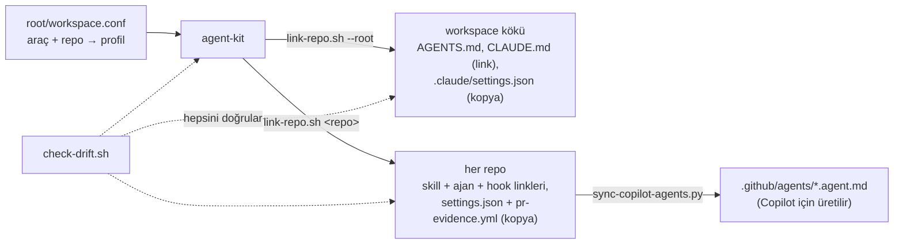

# Ajan yapımız nasıl çalışır

**Kısaca:** Kurallar ve ajan araçları tek yerde, `agent-kit`'te durur. Her repo onlara **link** verir, kopyalamaz.
Bir şeyi kit'te değiştirdiğinde tüm repolarda değişmiş olur; `check-drift.sh` her şeyin yerinde olduğunu kanıtlar.

## Üç katman — her kural tek yerde

| Katman | Dosya | İçinde ne var |
|---|---|---|
| Platform | `agent-kit/platform/AGENTS.md` (kökte `AGENTS.md`) | Her repoda geçerli: repo haritası, ortak veri, branch kuralları, 12 mühendislik prensibi, görev akışı |
| Repo | `<repo>/AGENTS.md` | Yalnız o repoya özgü olan; herkes aynı 8 başlığı kullanır. Çelişirse repo kazanır |
| Kit | `agent-kit/skills`, `agents`, `hooks`, `templates` | Nasıl çalışılır: skill'ler, reviewer ajanları, otomatik korkuluklar |

## Mühendislik prensipleri — ajan her istekte görür

Platform rehberinin 12 maddesi (`platform/principles.md` ile aynı metin); her oturumda, her repoda yüklenir. İlk
beşi Andrej Karpathy'nin LLM ile kod yazma prensiplerini taşır (düşün · basit · cerrahi · hedefe göre doğrula):

1 önce düşün (varsayım yok, iki okuma varsa ikisini sun, itiraz et) · 2 "bitti"yi önce tanımla, kanıtla ·
3 kapıların hepsi yeşil, sayıyla · 4 basitlik merdiveni (YAGNI → mevcut kod → stdlib → platform → bağımlılık) ·
5 cerrahi değişiklik (her satır isteğe bağlanır) · 6 önce kök neden · 7 her davranış değişikliğine test (bug'da
önce kırmızı, test atlanmaz) · 8 girdi sınırda doğrulanır · 9 sırlar okunmaz · 10 insana kalan işler yazılır ·
11 kararlar ADR · 12 mühendisliğe ait olmayan metinlere (hukuk, uyum) dokunulmaz.

## Kit repolara nasıl bağlanır



## Her repoda hangi dosya var, ne işe yarar

| Dosya | Ne işe yarar | Kaynağı |
|---|---|---|
| `CLAUDE.md` | Tek satır: `@AGENTS.md`. Claude'un repo rehberini okumasını sağlar | repoda |
| `AGENTS.md` | Repo rehberi: nerede ne var, kurallar, testler, kapı komutu | repoda (şablon: `templates/AGENTS.*.md`) |
| `.claude/settings.json` | İzinler (neye izin var, neyi sorar, neyi asla yapamaz) + hook'lar | kit şablonunun **kopyası** |
| `.claude/hooks` | Düzenlenen dosyayı biçimlendirir, oturum sonunda hatırlatır, PR kapısı | kit'e **link** |
| `.claude/skills/*` | Skill'ler (Claude ve Copilot okur); repo profiline göre | kit'e **link** |
| `.claude/agents/*.md` | Reviewer ajanları | kit'e **link** |
| `.github/agents/*.agent.md` | Aynı ajanların Copilot biçimi | **üretilir** |
| `.github/copilot-instructions.md`, `.github/hooks/`, `.vscode/` | Copilot'un rehber işaretçisi, hook'ları, izinleri | tohum (bir kez yazılır, sonra repoya ait) |
| `docs/` | Bilgi tabanı: engineering / domain / decisions (ADR) | tohum |
| `.github/workflows/pr-evidence.yml` | PR açıklamasında doğrulama + review var mı diye bakan CI | kit şablonunun **kopyası** |
| `.claude/kit.conf` | Bu reponun profili, aracı, modu | link-repo yazar |

**Profil:** backend repolar `new-endpoint`, `db-migration` ve `backend-reviewer`'ı; frontend repolar `verify-ui`,
`ui-check`, `impeccable` ve `frontend-reviewer`'ı alır. Ortak: `write-spec`, `implement-task`, `review`,
`commit-and-pr`, `security-reviewer`.

**Tek repo kurulumu** (workspace yoksa): aynı dosyalar link yerine **kopya** olarak `.claude/` altına gelir, 12
prensip `docs/engineering/principles.md`'ye yazılır ve `CLAUDE.md` onu da içe aktarır. `install.sh --check` kopyaları
kit'le bayt bayt karşılaştırır.

## Kit'i yöneten script'ler

- `install.sh` — makinede workspace'i kurar: eksik repoları klonlar, kökü, kit'i ve her repoyu bağlar, kontrol eder.
- `scripts/link-repo.sh` — bir repoyu, kökü (`--root`) ya da kit'in kendisini (`--kit`) bağlar; "doğru kurulum" tanımı burada.
- `scripts/check-drift.sh` — kök + kit + tüm repolar; sonuç `check-drift: clean` olmalı.
- `scripts/sync-copilot-agents.py` — Copilot ajan ikizlerini üretir (link-repo çağırır).

## İz nerede durur

Her iş bir branch'tir; izi workspace kökünde `agent-work/<branch-adı>/` altında durur ve git'e girmez. İşin kendisi
(spec, plan) bu klasörde; işin dokunduğu her repo kendi alt klasöründe (rapor, review, UI kontrolleri):

```
agent-work/feat-siparis-iadesi/
  spec.md                  ← Repo(lar): api-service, web-app
  plan.md
  api-service/  report.md  review.md
  web-app/      report.md  review.md  ui-smoke.md
```

PR kapısı `<repo>/review.md`'yi arar; hangi dosyanın hangi repoya ait olduğu klasör adından belli.

## Belgeler nerede durur

- **Platform geneli** (workspace'te): `agent-kit/platform/` — `AGENTS.md` (her istekte yüklenir), `SECURITY.md`,
  `DEPLOYMENT.md`, `SCHEMA.md` (paylaşılan veri modeli). Birden çok reponun ortak gerçeği tek kopyadır; iki repoda
  aynı konuyu anlatan iki belge zamanla ayrışır.
- **Repoya özgü:** `docs/` — `engineering/` (nasıl), `domain/` (ne), `decisions/` (neden, numaralı ADR). Her repoda
  aynı düzen; `AGENTS.md` kısa kalır, ayrıntıya link verir.
- **İnsanlar için:** `agent-kit/humans/` — sunum, rapor, araştırma; `archive/` eski belgeler.

Eski belgeleri bu yapıya taşırken iki kural:

1. **Belgeye değil koda güven.** Belgeler koddan geri kalır. Aktarılan her iddia koda karşı doğrulanır (uç, config
   anahtarı, tablo, workflow); çelişkide kod kazanır, doğrulanamayan `TODO(confirm)` olur. Belgeyi okuyan testler
   (içerik ya da yol sabitleyen) varsa taşımayla birlikte güncellenir.
2. **Eski belge arşive, link yok.** İçeriği `docs/`'a geçen belge repodan çıkar, `humans/archive/<repo>/` altına
   "arşivlendi" satırıyla gider. Yeni belge ve kod oraya link vermez; kod yorumlarındaki eski yollar da yenilenir.
