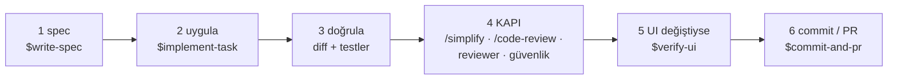

# Ajanlarla nasıl çalışırız

## 1. Claude'u nereden başlatırım

```bash
cd <workspace> && claude
```

**Her zaman workspace kökünden.** İşler çoğu zaman birden fazla repoyu etkiler. Kökten başlayınca Claude önce
platform rehberini okur, dokunduğu reponun `AGENTS.md`'sini kendisi yükler ve kökün ayarları (izinler, hook'lar,
PR kapısı) tüm repolar için geçerli olur. Copilot'ta VS Code'da `workspace.code-workspace`'i aç.

## 2. Bir görev — 6 adım



Ajanla normal konuşarak çalışırsın ("şu özelliği ekle", "bu hatayı düzelt"); uygun skill'i kendisi seçer. İstersen
`$ad` diye skill'i doğrudan çağırırsın. Commit ve PR yalnız sen isteyince yapılır, **merge her zaman senin**.

## 3. PR kapısı — kurallar gerçekten uygulandı mı

Claude `git push` ya da `gh pr create` çalıştırmak istediğinde bir hook oturumun kaydına bakar. Şunlar yoksa
komutu **durdurur** ve neyin eksik olduğunu yazar:

1. `/simplify` · 2. `/code-review` · 3. reponun reviewer ajanı (`backend-reviewer` / `frontend-reviewer`) ·
4. güvenlik taraması (`/security-review` ya da `security-reviewer`; auth, izin, sır, migration değiştiyse ajan şart)
· 5. bulgular `agent-work/<branch>/<repo>/review.md`'ye yazılmış.

PR açılınca `pr-evidence.yml` açıklamada "Nasıl doğrulandı" ve "Self-review" bölümlerini arar; Copilot'un ya da
insanın açtığı PR'lar da buna takılır. Bilinçli istisna (ör. yalnız yazım düzeltmesi): komutun başına
`KIT_GATE_SKIP=1 KIT_GATE_REASON=neden` — geçer ama `gate-skips.log`'a yazılır, reviewer görür. Her oturumun
sonunda Claude o oturumda **gerçekten** hangi skill ve ajanların koştuğunu tek satırda yazar.

## 4. Skill ve ajanlar

| Ad | Ne zaman | Kim çağırır |
|---|---|---|
| `write-spec` | İş tek oturumu aşıyorsa ya da başkasına (alt-ajan, Copilot coding agent) verilecekse | sen / ajan |
| `implement-task` | "Bunu yap", "şunu düzelt" | ajan |
| `new-endpoint` · `db-migration` | Yeni endpoint · tablo/kolon değişikliği (backend) | ajan, isteğinden |
| `verify-ui` · `ui-check` | Her ekran değişikliği · sürüm öncesi tam tarama (frontend) | ajan, tarayıcıyla |
| `impeccable` | Tasarım eleştirisi, cila (frontend) | sen / ajan |
| `review` · reviewer ajanları | Kapıda, PR öncesi | ajan |
| `commit-and-pr` | "Commit at", "PR aç" | ajan |

Kişisel skill'ler `~/.claude/skills/` altına konur, kit'e girmez.

## 5. Kurulum (yeni bilgisayar) ve bakım

```bash
mkdir <workspace> && cd <workspace>
git clone <agent-kit reposunun adresi> agent-kit     # klasör adı agent-kit olmalı
agent-kit/install.sh                                  # eksik repoları klonlar + her şeyi bağlar + "check-drift: clean"
```

Kimseye dosya göndermezsin: kökteki `AGENTS.md`, `CLAUDE.md`, `.claude/` kit'ten kurulur. Kişisel izinler
(şifresiz!) `.claude/settings.local.json`'a, herkes kendi yazar. Kit güncellenince `agent-kit/install.sh --refresh`
(kit'e ait kopyaları — settings, CI kontrolü — yeniler; repoların kendi dosyalarına dokunmaz).

`check-drift` şikâyet ederse: `stale`/`missing` → `agent-kit/scripts/link-repo.sh <repo>` · settings `drift` →
`link-repo.sh <repo> --refresh` · başlık `drift` → o reponun AGENTS.md'si şablonla eşitlenir. impeccable yalnız kit'te
`npx impeccable update` ile güncellenir.

**Sınırlar:** Copilot coding agent (bulut) yalnız tek repoyu klonlar, kardeş klasördeki kit'e giden link'ler orada
boştur — o repoyu tek-repo modunda (kopya) kur ya da işi yerelde yap. Windows'ta symlink için Developer Mode +
`git config core.symlinks true` gerekir; yoksa tek-repo modu.
